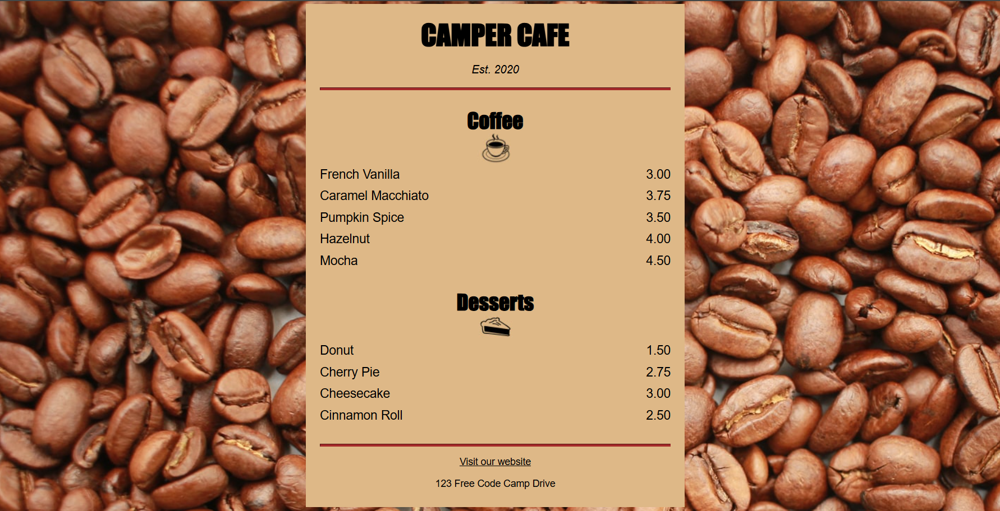
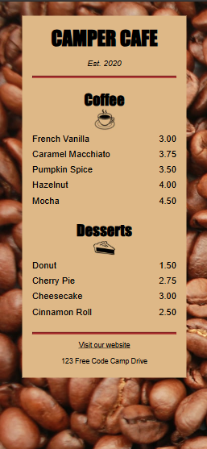

Cafe Menu Template — Responsive Menu App (freeCodeCamp Project)

 

A clean, responsive café menu built as a freeCodeCamp exercise.

## Purpose / Objective
This project demonstrates practical front-end skills (semantic HTML, modular CSS, responsive layout and basic accessibility) in a small, real-world component: a café menu.  
The goal is twofold: (1) to showcase a finished, well-structured project that was built from start to finish; (2) to serve as a reusable starter template to quickly adapt to a client (bar, cafe, or small restaurant).

### Desktop

### Mobile

## Technologies

- **HTML5**
  - Semantic elements: `main`, `section`, `article`, `footer`, `h1`, `h2`, `p`.
  - Use of `img` with `alt` attributes for accessibility.
  - Meta viewport for basic responsive layout: `<meta name="viewport" content="width=device-width, initial-scale=1.0">`.

- **CSS3**
  - Layout controls with `width`, `max-width`, and block/inline-block displays to shape the menu card.
  - Centering and spacing using `margin: auto` and padding.
  - Typography styling (sizes for `h1`, `h2`, `p`) and spacing adjustments.
  - Background image via `background-image` and visual styling for the panel.
  - Styling for structural elements such as `hr` and link states (`:hover`, `:visited`).

- **Accessibility & Best Practices**
  - Semantic structure to aid screen readers and navigation.
  - `alt` attributes on images for descriptive content.
  - Readability-focused text and contrast considerations.

- **Deployment / Version Control**
  - **Git / GitHub** for source control.
  - **GitHub Pages** used to host the live demo.

- **No external dependencies**
  - Static project: **no frameworks or build steps** — only HTML and CSS.

## Features
- Responsive menu layout (desktop / tablet / mobile)
- Simple, customizable style variables and comments to speed up edits
- Clear markup that’s easy to extend (add sections, prices, icons)
- Small footprint: no frameworks or build steps required — just HTML + CSS

## Future improvements
- Add CSS variables + theme switcher (light/dark)
- Convert to a modular component (React/Vue) for larger apps
- Add printable menu view (print-friendly CSS)
- Small JS enhancement: filter by category, search menu items

